# Event Flow - 이벤트 기반 처리 흐름

물품 배송 서비스의 도메인 이벤트 및 비동기 처리 흐름을 정의합니다.

## Overview

### 아키텍처 패턴
- **Event-Driven Architecture (EDA)**
- **Domain Events**: 도메인 상태 변경 시 발행
- **Event Handler**: 이벤트 수신 및 후속 처리
- **Eventual Consistency**: 도메인 간 최종 일관성

### 이벤트 전달 방식
| 방식 | 사용 케이스 |
|------|------------|
| 동기 (In-Process) | 같은 트랜잭션 내 처리 |
| 비동기 (Message Queue) | 외부 시스템 연동, 지연 처리 |
| Webhook | 외부 서비스 → 내부 시스템 |

---

## Domain Events

### Order Domain Events

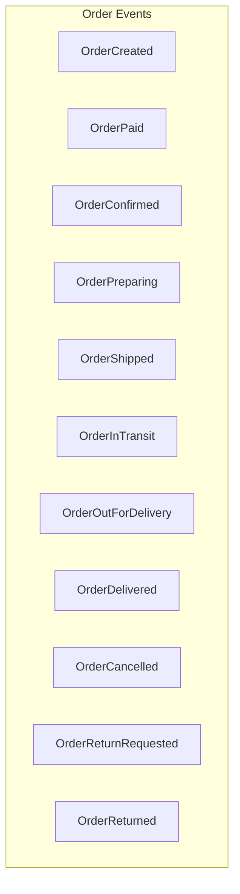

| Event | Trigger | Payload |
|-------|---------|---------|
| `OrderCreated` | 주문 생성 | orderId, customerId, sellerId, items, totalAmount |
| `OrderPaid` | 결제 완료 | orderId, paymentId, paidAt |
| `OrderConfirmed` | 판매자 확정 | orderId, sellerId, confirmedAt |
| `OrderPreparing` | 상품 준비 시작 | orderId |
| `OrderShipped` | 출고 완료 | orderId, shipmentId, carrier, trackingNumber |
| `OrderInTransit` | 배송 중 | orderId, shipmentId |
| `OrderOutForDelivery` | 배달 시작 | orderId, shipmentId |
| `OrderDelivered` | 배송 완료 | orderId, shipmentId, deliveredAt |
| `OrderCancelled` | 주문 취소 | orderId, reason, cancelledAt |
| `OrderReturnRequested` | 반품 요청 | orderId, returnId, reason |
| `OrderReturned` | 반품 완료 | orderId, returnId |

---

### Payment Domain Events

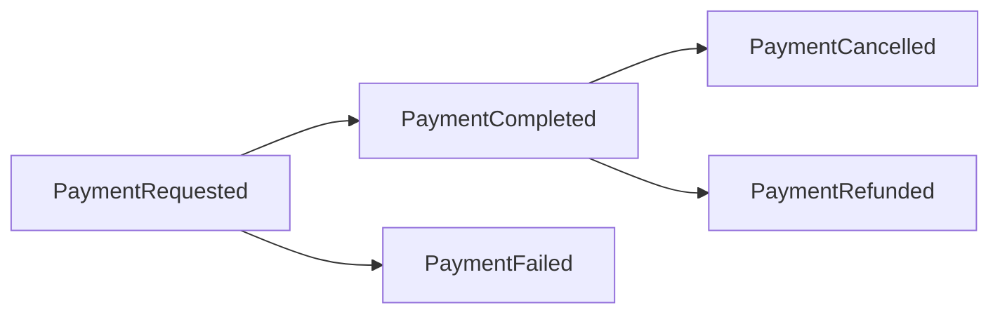

| Event | Trigger | Payload |
|-------|---------|---------|
| `PaymentRequested` | 결제 요청 | paymentId, orderId, amount, method |
| `PaymentCompleted` | 결제 성공 | paymentId, orderId, paidAt, transactionId |
| `PaymentFailed` | 결제 실패 | paymentId, orderId, reason, failedAt |
| `PaymentCancelled` | 결제 취소 | paymentId, orderId, cancelledAt |
| `PaymentRefunded` | 환불 완료 | paymentId, orderId, refundAmount, refundedAt |

---

### Shipment Domain Events

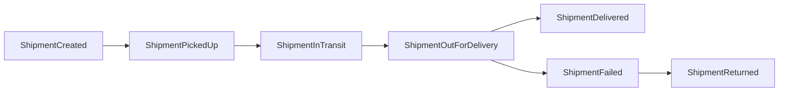

| Event | Trigger | Payload |
|-------|---------|---------|
| `ShipmentCreated` | 배송 생성 | shipmentId, orderId, carrier, trackingNumber |
| `ShipmentPickedUp` | 택배사 수거 | shipmentId, pickedUpAt |
| `ShipmentInTransit` | 허브 이동 중 | shipmentId, location |
| `ShipmentOutForDelivery` | 배달 시작 | shipmentId |
| `ShipmentDelivered` | 배송 완료 | shipmentId, deliveredAt, receiverName |
| `ShipmentFailed` | 배송 실패 | shipmentId, reason |
| `ShipmentReturned` | 반송 | shipmentId, returnedAt |

---

### Return Domain Events

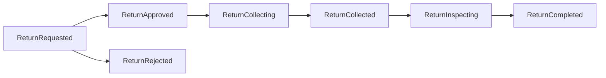

| Event | Trigger | Payload |
|-------|---------|---------|
| `ReturnRequested` | 반품 요청 | returnId, orderId, reason, items |
| `ReturnApproved` | 반품 승인 | returnId, approvedAt |
| `ReturnRejected` | 반품 거절 | returnId, reason, rejectedAt |
| `ReturnCollecting` | 수거 진행 | returnId, pickupShipmentId |
| `ReturnCollected` | 수거 완료 | returnId, collectedAt |
| `ReturnInspecting` | 검수 중 | returnId |
| `ReturnCompleted` | 반품 완료 | returnId, refundAmount, completedAt |

---

### Review Domain Events

| Event | Trigger | Payload |
|-------|---------|---------|
| `ReviewCreated` | 리뷰 작성 | reviewId, orderId, productId, rating, content |
| `ReviewUpdated` | 리뷰 수정 | reviewId, rating, content |
| `ReviewDeleted` | 리뷰 삭제 | reviewId |
| `ReviewReplyCreated` | 답글 작성 | reviewId, sellerId, content |
| `ReviewReplyUpdated` | 답글 수정 | reviewId, content |
| `ReviewReplyDeleted` | 답글 삭제 | reviewId |

---

### Product Domain Events

| Event | Trigger | Payload |
|-------|---------|---------|
| `ProductCreated` | 상품 등록 | productId, sellerId, name |
| `ProductUpdated` | 상품 수정 | productId, changes |
| `ProductStockUpdated` | 재고 변경 | productId, variantId, previousStock, newStock |
| `ProductStatusChanged` | 상태 변경 | productId, previousStatus, newStatus |
| `ProductSoldOut` | 품절 | productId, variantId |

---

## Event Handlers

### OrderCreated Event Handlers

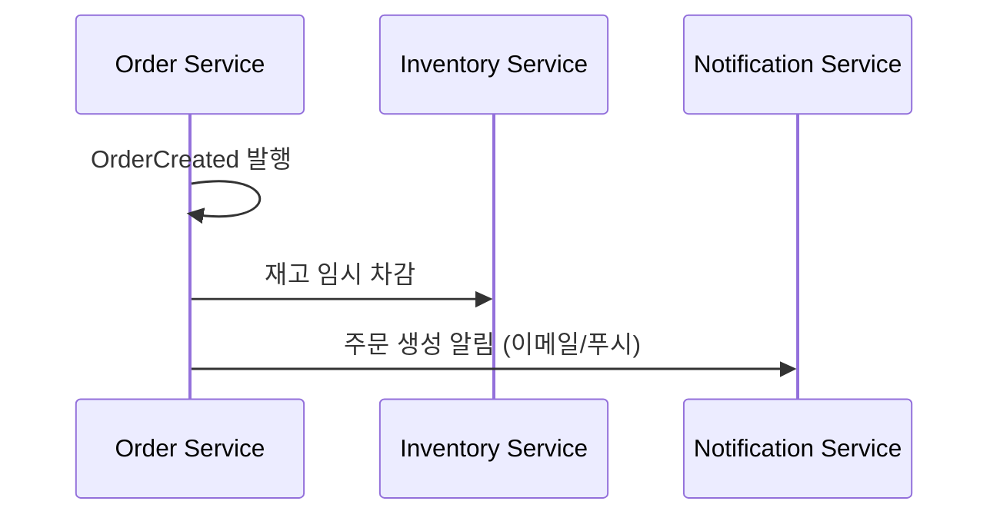

| Handler | Action |
|---------|--------|
| `InventoryReservationHandler` | 상품 재고 임시 차감 (Reserve) |
| `OrderNotificationHandler` | 고객에게 주문 접수 알림 발송 |

---

### OrderPaid Event Handlers

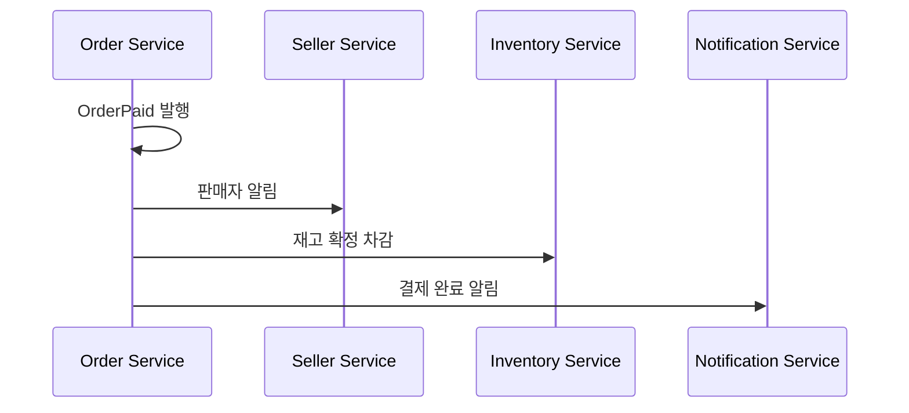

| Handler | Action |
|---------|--------|
| `SellerNotificationHandler` | 판매자에게 신규 주문 알림 |
| `InventoryConfirmHandler` | 재고 확정 차감 (Reserve → Commit) |
| `CustomerNotificationHandler` | 고객에게 결제 완료 알림 |

---

### OrderShipped Event Handlers

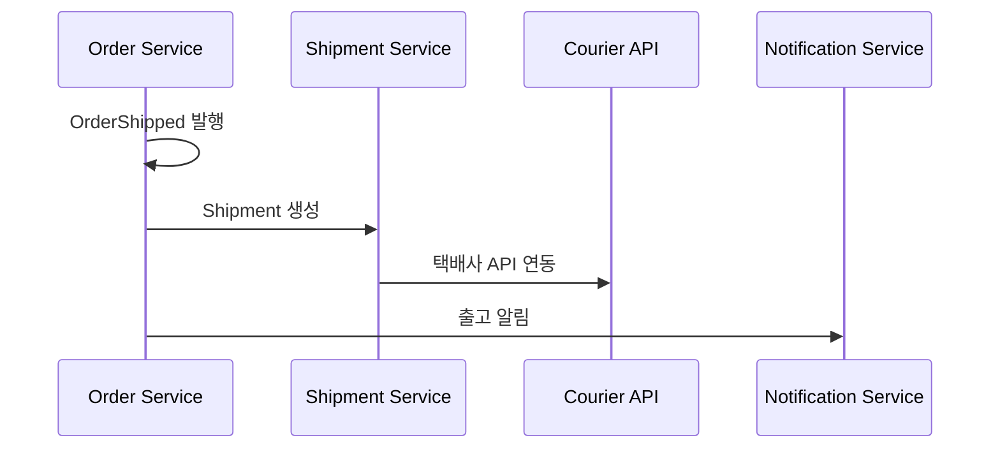

| Handler | Action |
|---------|--------|
| `ShipmentCreationHandler` | Shipment 도메인 생성 |
| `CourierIntegrationHandler` | 택배사 API 연동 (운송장 등록) |
| `CustomerNotificationHandler` | 고객에게 출고 알림 |

---

### OrderDelivered Event Handlers

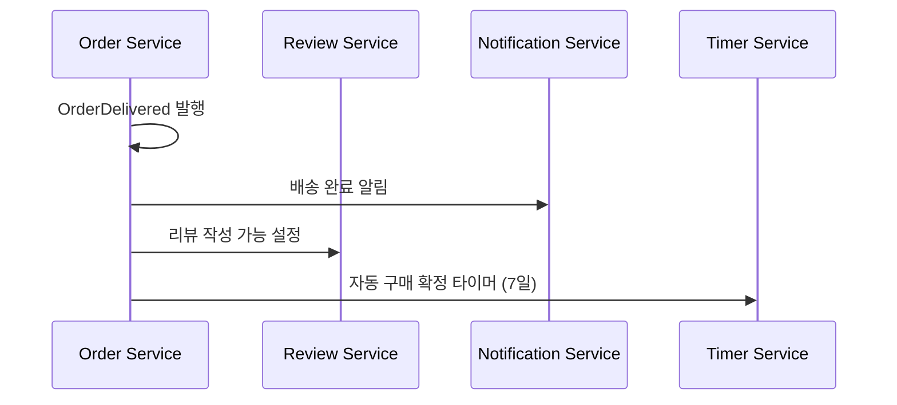

| Handler | Action |
|---------|--------|
| `CustomerNotificationHandler` | 고객에게 배송 완료 알림 |
| `ReviewEligibilityHandler` | 리뷰 작성 가능 상태로 변경 |
| `AutoConfirmScheduler` | 7일 후 자동 구매 확정 스케줄링 |

---

### OrderCancelled Event Handlers

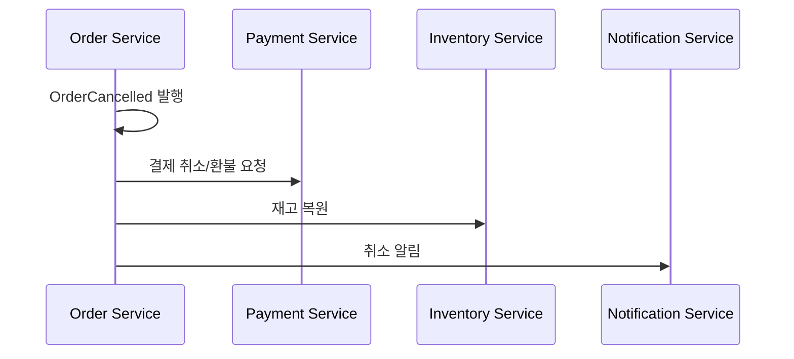

| Handler | Action |
|---------|--------|
| `PaymentRefundHandler` | 결제 취소 또는 환불 처리 |
| `InventoryRestoreHandler` | 차감된 재고 복원 |
| `CustomerNotificationHandler` | 고객에게 취소 완료 알림 |
| `SellerNotificationHandler` | 판매자에게 취소 알림 |

---

### PaymentCompleted Event Handlers

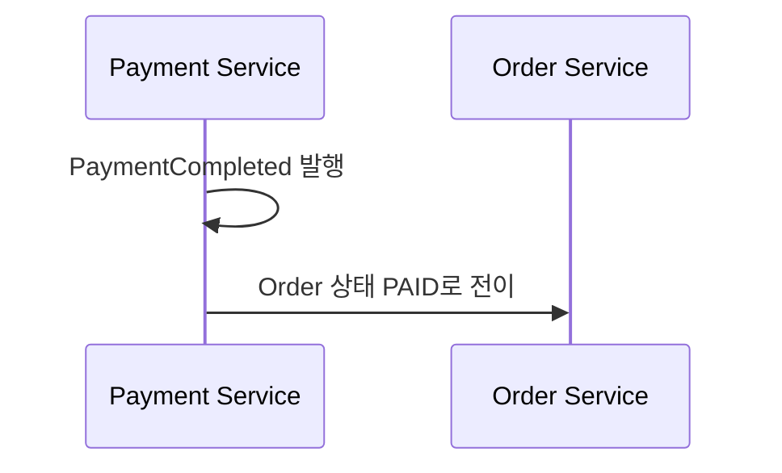

| Handler | Action |
|---------|--------|
| `OrderStatusHandler` | Order 상태를 PAID로 변경 |

---

### ReviewCreated Event Handlers

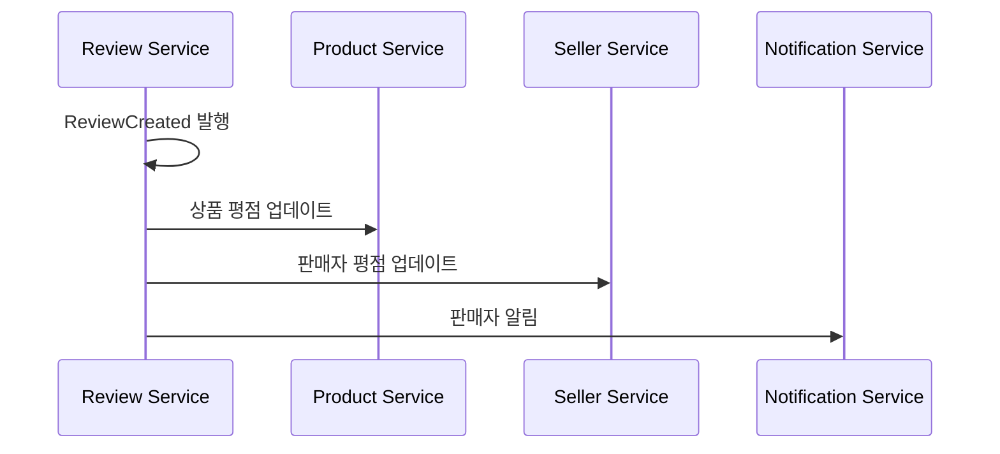

| Handler | Action |
|---------|--------|
| `ProductRatingHandler` | 상품 평균 평점 재계산 |
| `SellerRatingHandler` | 판매자 평균 평점 재계산 |
| `SellerNotificationHandler` | 판매자에게 새 리뷰 알림 |

---

### ReturnCompleted Event Handlers

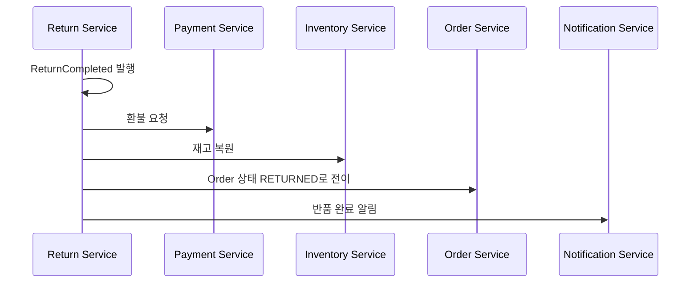

| Handler | Action |
|---------|--------|
| `PaymentRefundHandler` | 환불 처리 |
| `InventoryRestoreHandler` | 반품 상품 재고 복원 |
| `OrderStatusHandler` | Order 상태를 RETURNED로 변경 |
| `CustomerNotificationHandler` | 고객에게 반품 완료/환불 알림 |

---

## Webhook Integration

### Payment Gateway Webhooks

외부 PG사로부터 결제 결과를 수신합니다.

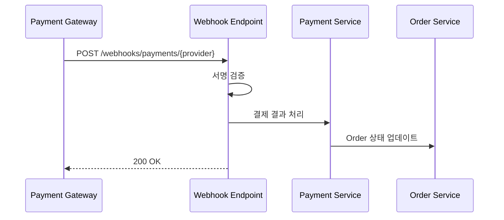

**Endpoint:** `POST /webhooks/payments/{provider}`

| Provider | Description |
|----------|-------------|
| `toss` | 토스페이먼츠 |
| `kakaopay` | 카카오페이 |
| `naverpay` | 네이버페이 |
| `inicis` | KG이니시스 |

**Webhook Payload Example (Toss):**
```json
{
  "eventType": "PAYMENT_COMPLETED",
  "paymentKey": "5zJ4xY7m0kODnyRpQWGrN",
  "orderId": "order-123",
  "amount": 50000,
  "status": "DONE",
  "approvedAt": "2025-01-01T10:00:00+09:00"
}
```

---

### Courier Webhooks

택배사로부터 배송 상태 업데이트를 수신합니다.

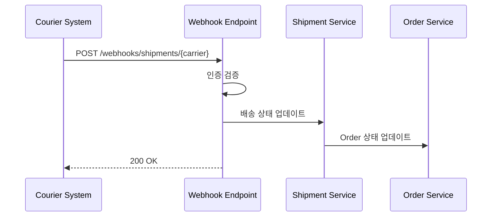

**Endpoint:** `POST /webhooks/shipments/{carrier}`

| Carrier | Description |
|---------|-------------|
| `cj` | CJ대한통운 |
| `hanjin` | 한진택배 |
| `lotte` | 롯데택배 |
| `logen` | 로젠택배 |
| `post` | 우체국택배 |

**Webhook Payload Example (CJ):**
```json
{
  "trackingNumber": "1234567890123",
  "status": "DELIVERED",
  "location": "서울 강남구 역삼동",
  "receiverName": "홍*동",
  "eventTime": "2025-01-01T14:30:00+09:00",
  "memo": "문 앞 배송"
}
```

---

## Event Publishing Pattern

### Transactional Outbox Pattern

이벤트 발행의 신뢰성을 보장하기 위해 **Transactional Outbox Pattern**을 사용합니다.

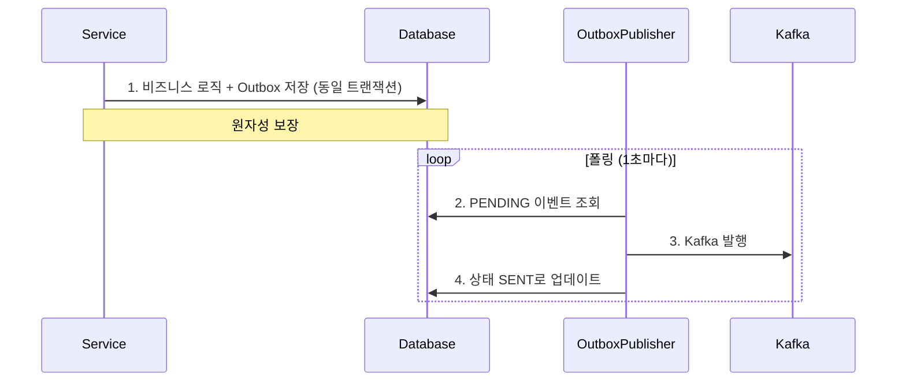

**핵심 컴포넌트:**

| Component | Description |
|-----------|-------------|
| `OutboxEvent` | 이벤트 저장 도메인 (id, aggregateType, payload, status) |
| `OrderOutboxAdapter` | OrderEventPort 구현, 이벤트를 Outbox 테이블에 저장 |
| `OutboxEventPublisher` | 스케줄러, PENDING 이벤트를 Kafka로 발행 |
| `OutboxEventCleaner` | 정리 스케줄러, 오래된 SENT 이벤트 삭제 |

**설정:**
```yaml
outbox:
  publisher:
    enabled: true
    fixed-delay: 1000        # 1초마다 폴링
    batch-size: 100          # 배치 크기
    timeout-seconds: 10      # Kafka 전송 타임아웃
  cleanup:
    enabled: true
    retention-days: 7        # 7일 보관
    cron: "0 0 3 * * ?"      # 매일 새벽 3시
```

**이벤트 발행 흐름:**
```java
// Service Layer
@Transactional
public Order createOrder(CreateOrderCommand command) {
    Order order = Order.create(...);
    orderRepository.save(order);

    // 동일 트랜잭션 내에서 Outbox에 저장
    orderEventPort.publish(OrderCreatedEvent.from(order));

    return order;
}

// OrderOutboxAdapter (Port 구현체)
@Component
public class OrderOutboxAdapter implements OrderEventPort {
    @Override
    public void publish(OrderEvent event) {
        OutboxEvent outboxEvent = toOutboxEvent(event);
        saveOutboxEventPort.save(outboxEvent);  // DB 저장
    }
}
```

---

### Consumer Idempotency (멱등성)

At-Least-Once 전달 보장으로 인한 중복 메시지를 처리하기 위해 **Event ID 기반 멱등성**을 구현합니다.

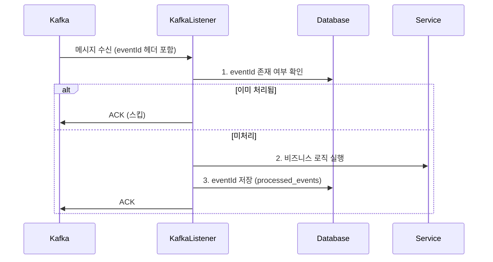

**핵심 컴포넌트:**

| Component | Description |
|-----------|-------------|
| `ProcessedEvent` | 처리된 이벤트 도메인 (eventId, eventType, processedAt) |
| `ProcessedEventPort` | 중복 체크 및 저장 포트 |
| `ProcessedEventJpaAdapter` | 포트 구현체 |

**Consumer 구현:**
```java
@KafkaListener(topics = "shipment.delivered")
@Transactional
public void handleDeliveryCompleted(
        @Payload ShipmentDeliveredEvent event,
        @Headers MessageHeaders headers,
        Acknowledgment acknowledgment
) {
    String eventId = extractHeader(headers, "eventId");

    // 멱등성 체크
    if (eventId != null && processedEventPort.existsByEventId(eventId)) {
        log.info("Skipping duplicate event: eventId={}", eventId);
        acknowledgment.acknowledge();
        return;
    }

    // 비즈니스 로직 실행
    updateOrderStatusUseCase.updateStatus(...);

    // 처리 완료 기록
    if (eventId != null) {
        processedEventPort.save(ProcessedEvent.of(eventId, eventType));
    }

    acknowledgment.acknowledge();
}
```

**DB 스키마:**
```sql
CREATE TABLE processed_events (
    event_id VARCHAR(100) PRIMARY KEY,
    event_type VARCHAR(100) NOT NULL,
    processed_at TIMESTAMP NOT NULL DEFAULT NOW()
);
CREATE INDEX idx_processed_events_processed_at ON processed_events(processed_at);
```

---

## Event Flow Summary

### 정상 구매 플로우

```
OrderCreated
    └─> 재고 예약
    └─> 주문 접수 알림

PaymentCompleted
    └─> Order → PAID
    └─> 재고 확정
    └─> 판매자 알림

OrderConfirmed
    └─> 고객 알림

OrderShipped
    └─> Shipment 생성
    └─> 택배사 연동
    └─> 출고 알림

ShipmentDelivered
    └─> Order → DELIVERED
    └─> 리뷰 작성 가능
    └─> 자동 구매확정 예약 (7일)
```

### 주문 취소 플로우

```
OrderCancelled
    └─> Payment 취소/환불
    └─> 재고 복원
    └─> 취소 알림
```

### 반품 플로우

```
OrderReturnRequested
    └─> Return 생성
    └─> 판매자 알림

ReturnApproved
    └─> 수거 택배 요청
    └─> 고객 알림

ReturnCompleted
    └─> Order → RETURNED
    └─> 환불 처리
    └─> 재고 복원
    └─> 반품 완료 알림
```

---

## Error Handling

### 이벤트 처리 실패 시

| 전략 | Description |
|------|-------------|
| Retry | 일시적 오류 시 재시도 (최대 3회) |
| Dead Letter Queue | 재시도 실패 시 DLQ로 이동 |
| Manual Intervention | DLQ 메시지 수동 처리 |
| Compensation | 보상 트랜잭션 실행 |

### 재시도 정책

```yaml
retry:
  max-attempts: 3
  backoff:
    initial-interval: 1000ms
    multiplier: 2
    max-interval: 10000ms
```

### 멱등성 보장

- 모든 이벤트에 `eventId` 포함
- 이벤트 처리 전 중복 체크
- Idempotency Key 저장소 활용
