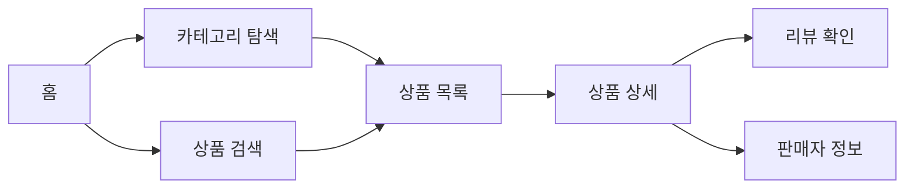
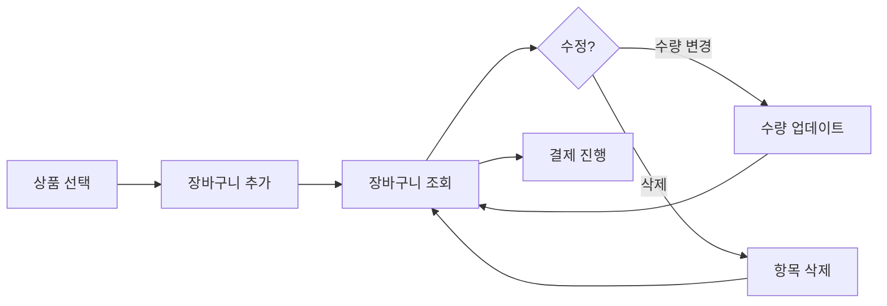
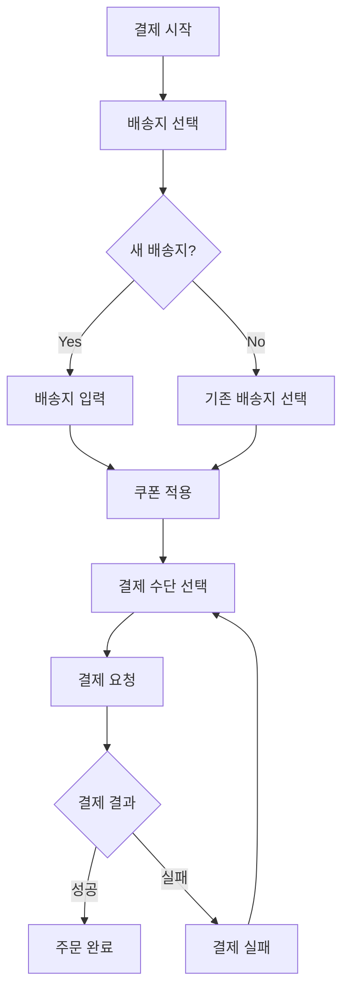
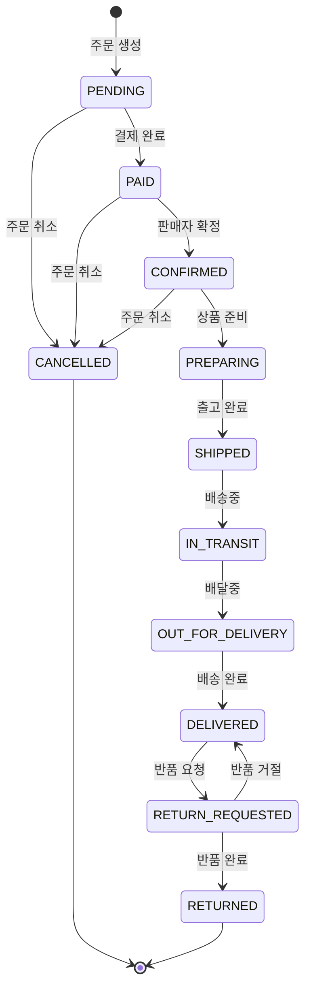
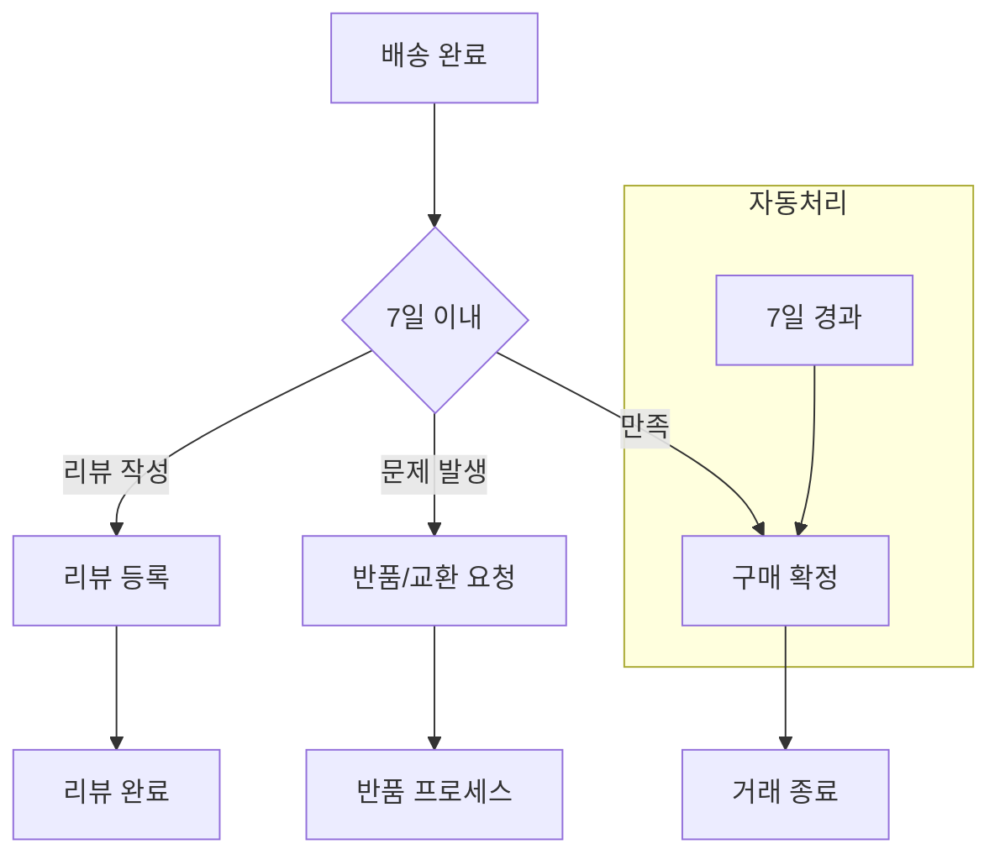
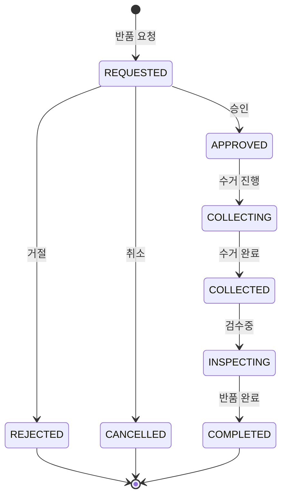
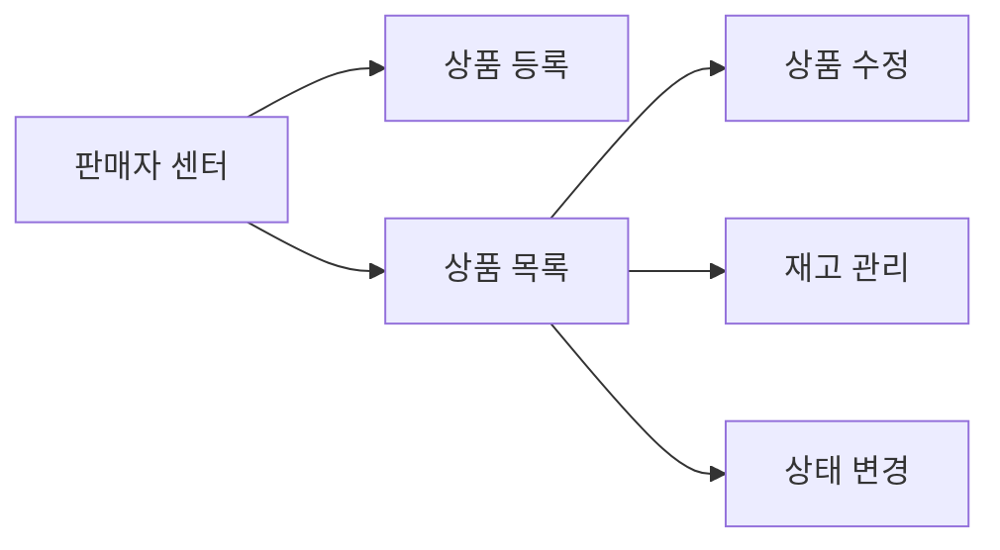
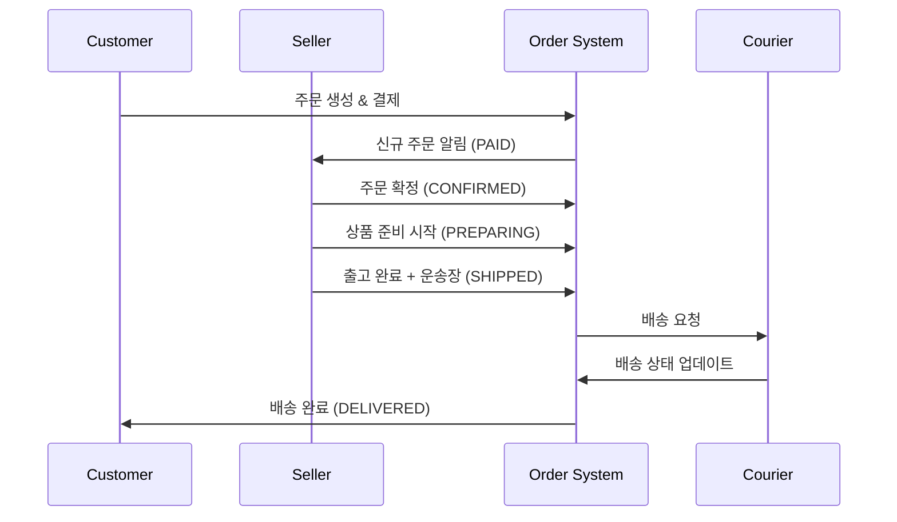
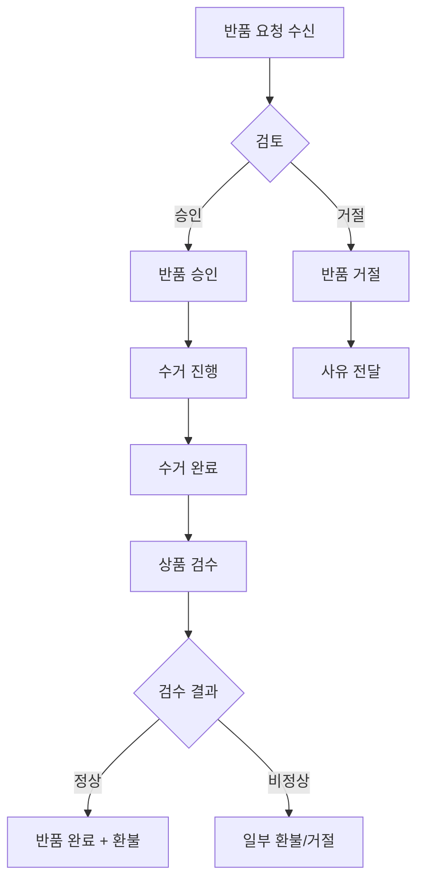
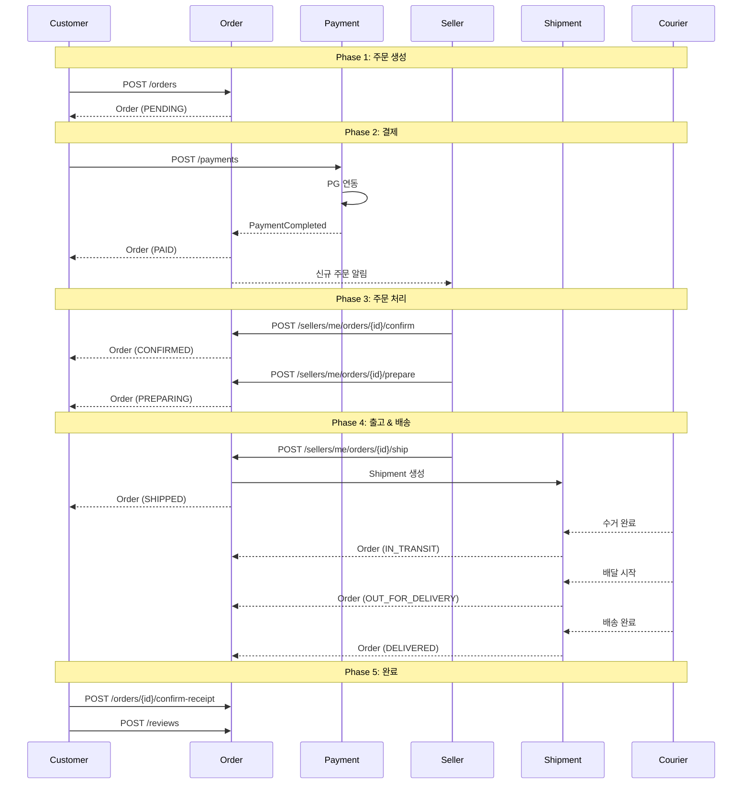

# User Service Flow - 사용자 서비스 플로우

물품 배송 서비스의 사용자 여정을 정의합니다.

## Overview

### 서비스 특성
- **서비스 유형**: 물품 배송 서비스 (Product Delivery)
- **배송 방식**: 택배사 연동 (Courier-based)
- **창고 구조**: 판매자당 단일 창고
- **배송 범위**: 국내 배송만
- **반품/교환**: 지원

### 주요 액터
| Actor | Description |
|-------|-------------|
| Customer | 상품 구매 고객 |
| Seller | 상품 판매자 |
| Courier | 택배사 (외부 시스템) |
| System | 자동화된 시스템 처리 |

---

## Customer Journey

### Phase 1: 탐색 (Discovery)

**사용자 액션:**
1. 카테고리별 상품 탐색
2. 키워드 검색 (상품명, 브랜드)
3. 필터링 (가격, 평점, 배송비)
4. 상품 상세 정보 확인
5. 변형 상품 (색상, 사이즈) 선택
6. 리뷰 및 평점 확인

**관련 API:**
| Endpoint | Description |
|----------|-------------|
| `GET /categories` | 카테고리 목록 조회 |
| `GET /products` | 상품 목록 (검색, 필터, 페이징) |
| `GET /products/{id}` | 상품 상세 조회 |
| `GET /products/{id}/variants` | 변형 상품 목록 |
| `GET /products/{id}/reviews` | 상품 리뷰 목록 |
| `GET /sellers/{id}` | 판매자 정보 조회 |

---

### Phase 2: 장바구니 (Cart)

**사용자 액션:**
1. 상품/변형 선택 후 장바구니 추가
2. 장바구니에서 수량 조정
3. 불필요한 상품 삭제
4. 예상 금액 확인

**관련 API:**
| Endpoint | Description |
|----------|-------------|
| `GET /cart` | 장바구니 조회 |
| `POST /cart/items` | 상품 추가 |
| `PATCH /cart/items/{id}` | 수량 변경 |
| `DELETE /cart/items/{id}` | 상품 삭제 |
| `DELETE /cart` | 장바구니 비우기 |

---

### Phase 3: 주문/결제 (Checkout & Payment)

**사용자 액션:**
1. 배송지 선택 또는 신규 입력
2. 배송 메모 입력
3. 쿠폰 선택 및 적용
4. 결제 수단 선택 (카드, 간편결제 등)
5. 결제 진행
6. 주문 완료 확인

**관련 API:**
| Endpoint | Description |
|----------|-------------|
| `GET /customers/me/addresses` | 배송지 목록 |
| `POST /customers/me/addresses` | 배송지 등록 |
| `GET /coupons` | 사용 가능 쿠폰 |
| `POST /orders` | 주문 생성 |
| `POST /payments` | 결제 요청 |
| `POST /payments/{id}/confirm` | 결제 확인 |

---

### Phase 4: 주문 추적 (Order Tracking)

**사용자 액션:**
1. 주문 내역 조회
2. 주문 상세 확인
3. 배송 추적 (운송장 번호)
4. 주문 취소 (PAID, CONFIRMED 상태에서만)

**관련 API:**
| Endpoint | Description |
|----------|-------------|
| `GET /orders` | 내 주문 목록 |
| `GET /orders/{id}` | 주문 상세 |
| `GET /orders/{id}/shipment` | 배송 정보 |
| `GET /shipments/{id}/tracking` | 배송 추적 이벤트 |
| `POST /orders/{id}/cancel` | 주문 취소 |

---

### Phase 5: 배송 완료 후 (Post-Delivery)

**사용자 액션:**
1. 상품 수령 확인
2. 구매 확정 (수동 또는 7일 후 자동)
3. 리뷰 및 평점 작성
4. 문제 시 반품/교환 요청

**관련 API:**
| Endpoint | Description |
|----------|-------------|
| `POST /orders/{id}/confirm-receipt` | 구매 확정 |
| `POST /reviews` | 리뷰 작성 |
| `PUT /reviews/{id}` | 리뷰 수정 |
| `DELETE /reviews/{id}` | 리뷰 삭제 |

---

### Phase 6: 반품/교환 (Return & Exchange)

**반품 사유:**
| Reason | Description | 귀책 |
|--------|-------------|------|
| `CHANGE_OF_MIND` | 단순 변심 | 고객 |
| `WRONG_ITEM` | 오배송 | 판매자 |
| `DEFECTIVE` | 불량/파손 | 판매자 |
| `DIFFERENT_FROM_DESC` | 상품 설명과 다름 | 판매자 |
| `DELAYED_DELIVERY` | 배송 지연 | 판매자 |
| `OTHER` | 기타 | - |

**사용자 액션:**
1. 반품/교환 사유 선택
2. 상세 사유 및 이미지 첨부
3. 수거 주소 확인
4. 수거 일정 선택
5. 반품 상태 추적
6. 환불 확인

**관련 API:**
| Endpoint | Description |
|----------|-------------|
| `POST /returns` | 반품/교환 요청 |
| `GET /returns` | 내 반품 목록 |
| `GET /returns/{id}` | 반품 상세 |
| `POST /returns/{id}/cancel` | 반품 취소 |

---

## Seller Journey

### Phase 1: 상품 관리 (Product Management)

**판매자 액션:**
1. 신규 상품 등록 (기본정보, 변형, 이미지)
2. 상품 정보 수정
3. 재고 수량 관리
4. 상품 활성화/비활성화

**관련 API:**
| Endpoint | Description |
|----------|-------------|
| `GET /sellers/me/products` | 내 상품 목록 |
| `POST /sellers/me/products` | 상품 등록 |
| `PUT /sellers/me/products/{id}` | 상품 수정 |
| `DELETE /sellers/me/products/{id}` | 상품 삭제 |
| `PATCH /sellers/me/products/{id}/stock` | 재고 수정 |
| `PATCH /sellers/me/products/{id}/status` | 상태 변경 |

---

### Phase 2: 주문 처리 (Order Processing)

**판매자 액션:**
1. 신규 주문 확인
2. 주문 확정 처리
3. 상품 준비 시작
4. 운송장 등록 및 출고 처리

**관련 API:**
| Endpoint | Description |
|----------|-------------|
| `GET /sellers/me/orders` | 주문 목록 (상태별 필터) |
| `GET /sellers/me/orders/{id}` | 주문 상세 |
| `POST /sellers/me/orders/{id}/confirm` | 주문 확정 |
| `POST /sellers/me/orders/{id}/prepare` | 준비 시작 |
| `POST /sellers/me/orders/{id}/ship` | 출고 (운송장 등록) |
| `POST /sellers/me/orders/{id}/cancel` | 주문 취소 |

---

### Phase 3: 반품 관리 (Return Management)

**판매자 액션:**
1. 반품 요청 확인
2. 반품 승인/거절 처리
3. 수거 택배 요청
4. 상품 검수
5. 환불 처리

**관련 API:**
| Endpoint | Description |
|----------|-------------|
| `GET /sellers/me/returns` | 반품 목록 |
| `POST /sellers/me/returns/{id}/approve` | 반품 승인 |
| `POST /sellers/me/returns/{id}/reject` | 반품 거절 |
| `POST /sellers/me/returns/{id}/complete` | 반품 완료 |

---

### Phase 4: 리뷰 관리 (Review Management)

**판매자 액션:**
1. 리뷰 목록 확인
2. 리뷰에 답글 작성
3. 부적절한 리뷰 신고

**관련 API:**
| Endpoint | Description |
|----------|-------------|
| `GET /sellers/me/reviews` | 내 상품 리뷰 |
| `POST /sellers/me/reviews/{id}/reply` | 답글 작성 |
| `PUT /sellers/me/reviews/{id}/reply` | 답글 수정 |
| `DELETE /sellers/me/reviews/{id}/reply` | 답글 삭제 |

---

## Complete Order Lifecycle

---

## 취소 가능 상태

| Order Status | 취소 가능 | 취소 주체 | 환불 |
|--------------|----------|----------|------|
| PENDING | O | 고객 | 결제 전 |
| PAID | O | 고객/판매자 | 전액 환불 |
| CONFIRMED | O | 고객/판매자 | 전액 환불 |
| PREPARING | △ | 판매자 (협의) | 전액 환불 |
| SHIPPED | X | - | 반품 절차 |
| IN_TRANSIT | X | - | 반품 절차 |
| OUT_FOR_DELIVERY | X | - | 반품 절차 |
| DELIVERED | X | - | 반품 절차 |
